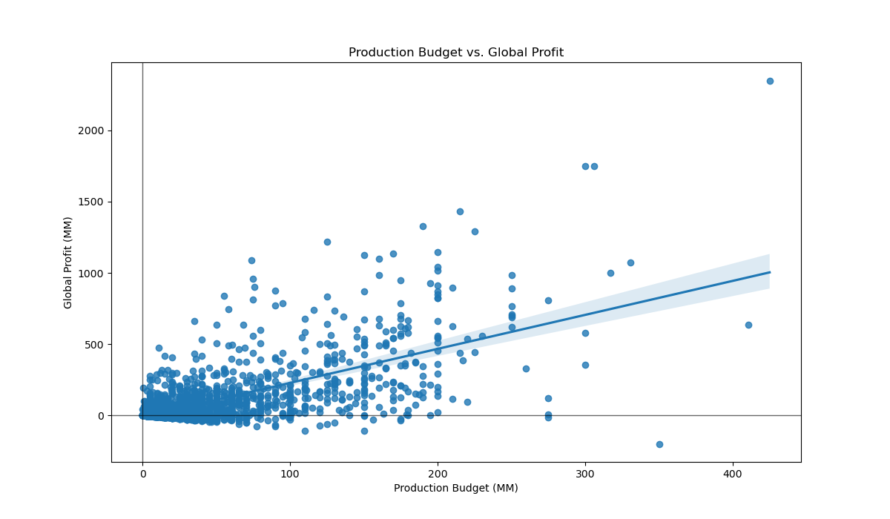

# Microsoft Movie Analysis 
***
**Author:** Rebecca Chu


## Overview
***

This project analyses the types of films that have been the most successful at the box office from 2009 to 2019. Success was defined predominately by ROI and global profit, however audience sentiment was also taken into consideration. Descriptive analysis found that high-budget films tended to yield the best ROI and profit, and the best months to release a film was during July and November. Animation, Adventure, Fantasy and Family films were also the most profitable, while audiences rated movies with a runtime between 150 to 180 minutes highly although there appeared to be no relationship between average rating and profitability. These actionable insights can be used as guide for Microsoft to create a movie with the highest chance of commercial success.


## Business Problem
***

Microsoft is looking to create a new movie studio that produces profitable original video content and would like to know the types of movies that are the most successful at the box office. Based on an exploratory data analysis, they are looking for actionable insights that can be implemented to create movies with the highest chance of commercial success and popularity.

The following data questions posed as a guide for my analysis: 

* What is the relationship between production budget and global profit/ profitability?
* Does release month have a relationship on ROI?
* Are certain genres more profitable than other?
* Is there a relationship between average rating and profitability?
* What is the relationship between runtimes and average ratings?


## Data
***

For this analysis, data was sourced from The Numbers, The Movie Database (TMDb), and IMDb, all of which are online database with extensive metadata for movies.

#### The Numbers
The Numbers data provided financial data for 5,782 movies and was used to determine the profitability of each movie. For this analysis, the target data was the production budget and the worldwide gross, which were used to calculate ROI. ROI was consequently used to assess whether a movie was considered a box office success.

#### TMDb¶
TMDb is a community built movie and TV database and their dataset provides information regarding genre, release date, vote average, and lifetime popularity score, all of which are factors that may determine the success of a film. I joined this dataset to The Numbers dataset to analyse the relationship between genre, vote average and the release month with profitability/ ROI.

#### IMDb

IMDb datasets are available online (https://developer.imdb.com/non-commercial-datasets/) and refreshed daily. So that I was working with the most recent data, I downloaded ```title.basics.tsv.gz``` and ```title.ratings.tsv.gz``` on the 7th of August 2023. These datasets were joined and used to provide an understanding of the relationship between audience ratings and runtimes.

Only movies between 2009 and 2022 were analysed to ensure we were looking within a similar time period as The Numbers and TMDb datasets.

Note: Given the exhaustive nature of ```title.basics.tsv.gz```, I dropped irrelevant information and created a new reduced csv file ```imdb_basics.aug23_reduced.csv.gz``` to work with. For more information please see the ```imdb_do_not_run``` notebook. The original dataset contained 10,058,021 entries, and the csv file I created contained 210,566 entries.


## Methods
***

This project used exploratory and descriptive analysis to visualise the relationships between film variables with profitability. I began by cleaning the dataframes to ensure there were no null values or duplicates, and any irrelevant information was dropped. To ensure that we were looking at recent data, movie release years were filtered between 2009 to 2019 for The Numbers and TMDb dataframe, and 2009 to 2023 for IMDb. I also created the following metrics to assess the success of the film:

* Global profit: Worldwide Gross - Production Budget
* ROI: (Global Profit/ Production Budget)*100
* Production Budget binned into low-budget, mid-level and high-end categories 
* Financial data was converted into millions for readability
* Runtime minutes binned into 30 minute increments ranging from <30 to +270 minutes

I joined The Numbers and TMDb dataframes to explore the relationship between production budget, release month, genre and vote average with profitability. For average rating and runtime minutes, I used the IMDb dataframe.


## Results
***

There was a moderate to strong positive correlation between production budget and global profit (r=0.68). As we moved up the production budget axis we saw more varability.



There was a low negative correlation between production budget and ROI (r=-0.04), however there were a few low-budget films with extremely high ROIs; these outliers would have skewed results. When we categorised the films by budget, we could see that while the low-budget had the highest variability in ROI, it also had the lowest median ROI at 7%, barely even breaking even with production budget. High-end films had the highest median ROI at 163%. High-end production budget films will therefore typically yield a higher ROI and pull in greater global profit. 


ROI and global profits tended to be higher during the summer months of the Northern hemisphere, around November, and around February, corresponding with holiday periods and Valentine's Day.


Animation, Adventure, Fantasy and Family films tended to yield a high ROI and global profit. While Documentaries and Horror films had the highest ROI, as they were mostly low-end budget films they did not produce high global profits.


There appears to be no correlation between vote average and ROI (r=0.01) and a low positive correlation between vote average and global profit (r=0.30). 

An increase in runtime minutes corresponded with an increase in the average rating of a film. Note that films under 90 minutes and over 180 minutes had significantly less number of votes than films between 90 to 180 minute on average. 


## Conclusions
***

Based on this analysis, the following actionable insights are recommended:

* **Invest in a high-end production budget of at least 50 million USD to maximise profitability.** While low-budget movies have the potential to yield significant ROI, profits will remain low. High-end films not only yield a high ROI but also a signficant global profit.
* **Produce an Animated film within the Adventure, Fantasy, and/or Family genre.** The median global profit of an Animation film is over $200MM with a median ROI of 200%. Adventure, Fantasy and Family genres have also shown to yield high ROI and global profits. 
* **Release the film during July.** July sees the highest median ROI and greatest median global profits. This month corresponds with summer holidays in the Northern hemisphere and it is likely more people, particularly families, are watching movies during this break.
  
## Limitations and Next Steps
***

Data for the films was limited to 2019, and we were therefore unable to take into consideration the impact of COVID-19. It would be recommended to conduct this analysis with data from 2020 onwards for a more accurate representation of the current landscape of film. Furthermore, streaming services have impacted the way audiences have consumed movies in the last decade and it would be interesting to see how it has impacted box office numbers and the profitability of movies on streaming platforms.

## Repository Structure
***

```
├── README.md                                      <- The top-level README for reviewers of this project
├── microsoft-movie-analysis-final.ipynb           <- Narrative documentation of analysis in Jupyter notebook
├── imdb_do_not_run.ipynb                          <- Narrative documentation of preliminary data cleaning of IMDb dataset
├── microsoft-movie-analysis-presentation.pdf      <- PDF version of project presentation
├── data                                           <- Both sourced externally and generated from code
└── images                                         <- Both sourced externally and generated from code
```
